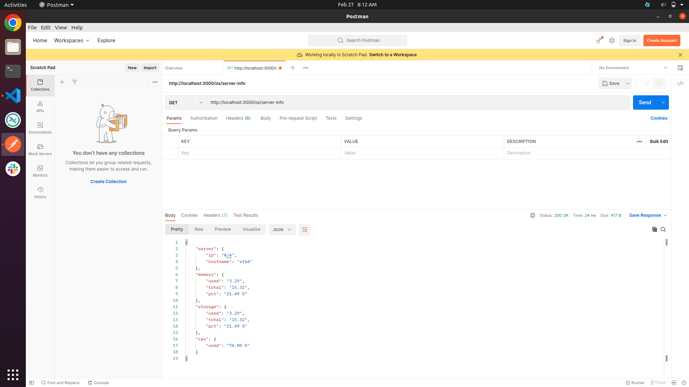
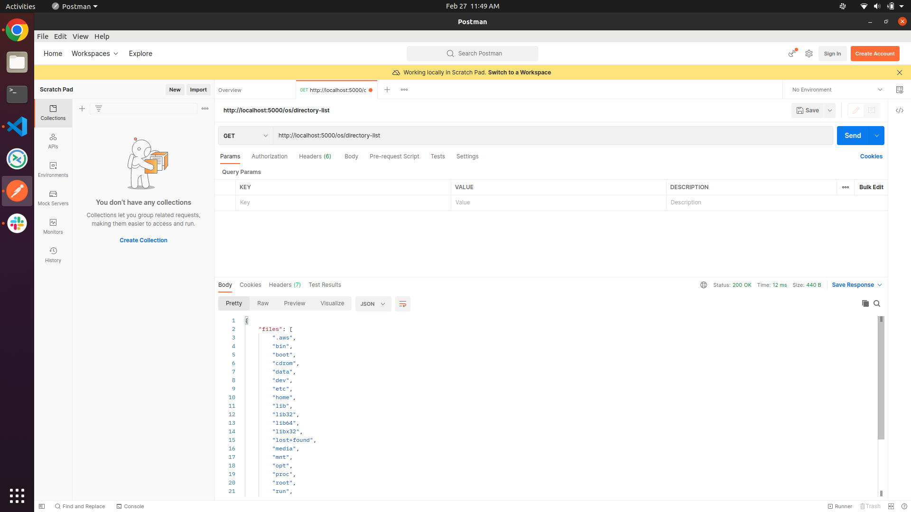

# Nodejs-backend Project

Develop an API that returns: Server IP and hostname, Memory Usage, Storage Usage and CPU Usage of the host machine
also develop another API that returns list of files and directories inside a given path.

## step-1 Install nodejs and check latest version

node -v

## step-2 Initialize your Project

npm init -y

## step-3 install the express module

npm install express   
npm install morgan   
npm install body-parser

## step-4 create the file index.js and logic.js

## step-5 launch your server

node server.js

## open your web browser and visit

localhost:5000/os/server-info    
localhost:5000/os/directory-list

## open the postman and copy localhost:5000/os/server-info and send it.

# backend Application node-js-express-js

